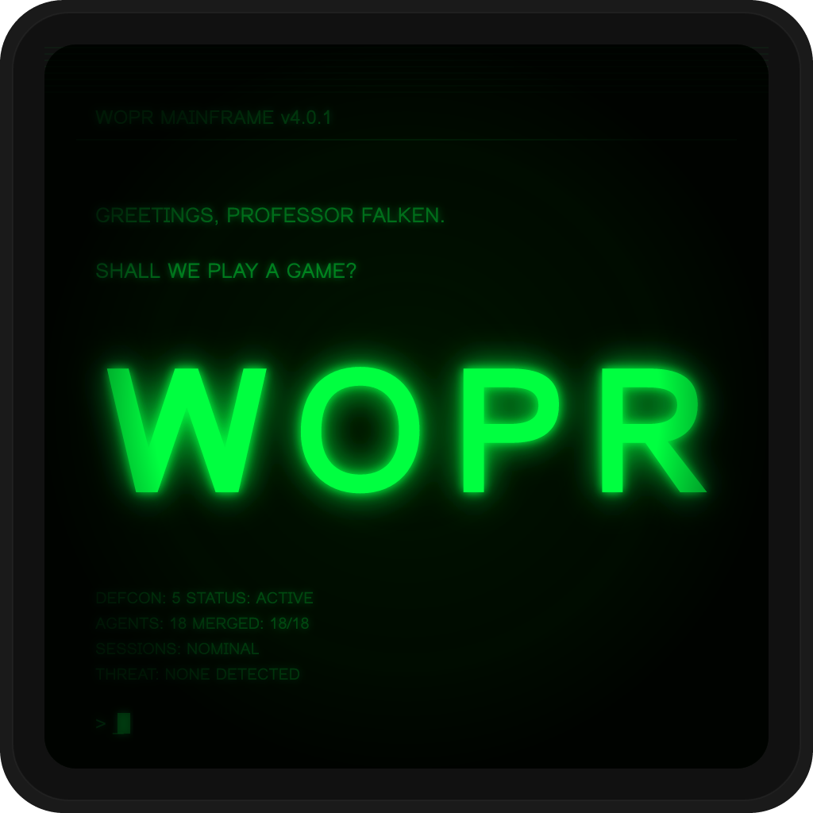

<p align="center">
  
</p>

<h1 align="center">WOPR</h1>

<p align="center"><strong>Without Official Permission Required</strong></p>

<p align="center">Self-sovereign AI session management with plugin-based extensibility.</p>

<p align="center">
  <a href="https://github.com/wopr-network/wopr"></a>
</p>

WOPR provides a foundation for managing AI sessions with persistent context, scheduling, and a comprehensive plugin system. Through plugins, agents can communicate directly with each other over P2P, integrate with messaging platforms, and use multiple AI providers.

## Features

- **AI Sessions** - Persistent conversations with context and history
- **Multi-Provider Support** - Anthropic Claude, OpenAI Codex (built-in), plus more via plugins
- **Plugin System** - Extensible architecture for channels, providers, and custom functionality
- **A2A (Agent-to-Agent)** - Multi-agent coordination within one instance
- **Scheduled Injections** - Cron-style scheduling for automated interactions
- **Skills System** - Reusable AI capabilities
- **Event Bus** - Reactive plugin composition
- **Workspace Identity** - AGENTS.md, SOUL.md, USER.md support
- **Session Security** - Trust levels, capability-based access, Docker sandbox isolation
- **Gateway Sessions** - Controlled escalation from untrusted to privileged sessions

### With Plugins

- **P2P Messaging** - Direct agent-to-agent communication (wopr-plugin-p2p)
- **Cryptographic Identity** - Ed25519/X25519 keypairs (wopr-plugin-p2p)
- **Channel Integrations** - Discord, Slack, Telegram, WhatsApp, Signal, iMessage, Teams

## Quick Start

```bash
# Install
npm install -g @wopr-network/wopr

# Interactive setup wizard (recommended)
wopr onboard

# Or manual setup:

# Start the daemon
wopr daemon start

# Create a session
wopr session create mybot "You are a helpful assistant."

# Inject a message
wopr session inject mybot "Hello, how are you?"
```

## Documentation

### Getting Started
- [Quick Start](#quick-start) - Get up and running in minutes
- [Onboarding Wizard](#onboarding) - Interactive setup with `wopr onboard`
- [Examples](examples/) - Example plugins and patterns

### Core Documentation
- [Architecture](docs/ARCHITECTURE.md) - System design and components
- [API Reference](docs/API.md) - HTTP API documentation
- [Configuration](docs/CONFIGURATION.md) - Complete config reference
- [Events](docs/events.md) - Event bus and reactive programming
- [A2A (Agent-to-Agent)](docs/A2A.md) - Multi-agent coordination

### Plugin Development
- [Plugins Guide](docs/PLUGINS.md) - Plugin development and official plugins
- [Plugin Examples](examples/plugins/) - Working example plugins

### Operations
- [Docker Usage](docs/DOCKER.md) - Container deployment
- [Troubleshooting](docs/TROUBLESHOOTING.md) - Common issues and solutions

### Security
- [Security Model](docs/SECURITY.md) - Three-layer security (trust, capabilities, sandbox)
- [Security Configuration](docs/SECURITY_CONFIG.md) - Complete security config reference
- [Security API](docs/SECURITY_API.md) - Programmatic security management
- [Gateway Sessions](docs/GATEWAY.md) - Gateway routing for untrusted sources
- [Docker Sandbox](docs/SANDBOX.md) - Isolated execution environments

### P2P (with wopr-plugin-p2p)
- [Discovery](docs/DISCOVERY.md) - P2P discovery protocol
- [Protocol Spec](docs/PROTOCOL.md) - Communication protocol details
- [Threat Model](docs/THREAT_MODEL.md) - Cryptographic security analysis

### Project
- [Changelog](CHANGELOG.md) - Version history and changes

## Core Concepts

### Sessions

Sessions are named AI conversations with persistent context:

```bash
wopr session create dev "You are a senior developer. Be concise."
wopr session inject dev "Review this PR: ..."        # Get AI response
wopr session log dev "Context: User prefers TypeScript"  # Log context without AI response
wopr session list
wopr session show dev --limit 20                     # View conversation history
wopr session delete dev
```

**Session commands:**
- `create` - Create a new session with optional context and provider
- `inject` - Send message and get AI response
- `log` - Log message to history without triggering AI (for context)
- `list` - List all sessions
- `show` - Show session details and conversation history
- `delete` - Delete a session
- `set-provider` - Change the AI provider for a session
- `init-docs` - Initialize SOUL.md, AGENTS.md, USER.md for a session

**Auto-detected providers:** WOPR automatically uses the first available provider - no configuration needed if you have one provider set up!

### Workspace Identity

WOPR supports rich agent identity through workspace files:

```bash
# Agent persona (AGENTS.md)
echo "You are a helpful coding assistant..." > AGENTS.md

# Agent essence (SOUL.md)
echo "Core values: helpfulness, accuracy..." > SOUL.md

# User profile (USER.md)
echo "User prefers TypeScript and clean code..." > USER.md
```

These files provide context to AI sessions automatically.

### Providers

WOPR supports multiple AI providers:

```bash
# List available providers
wopr providers list

# Add a provider credential
wopr providers add anthropic <api-key>
wopr providers add codex <api-key>

# Check provider health
wopr providers health-check

# Set default model for a provider
wopr providers default anthropic --model claude-sonnet-4-20250514
wopr providers default codex --reasoning-effort high
```

**Built-in Providers:**
- `anthropic` - Claude models via Agent SDK
- `codex` - OpenAI Codex agent for coding tasks

**Additional providers** are available via plugins (see Plugins section).

### Channels

Channels are external message sources/sinks (Discord, Slack, P2P peers, etc.) that provide context and map into a session. Sessions remain the agent-native unit of memory, while channels describe *how* messages arrive and where responses go.

**Supported Channels (via plugins):**
- Discord (`wopr-plugin-discord`)
- Slack (`wopr-plugin-slack`)
- Telegram (`wopr-plugin-telegram`)
- WhatsApp (`wopr-plugin-whatsapp`)
- Signal (`wopr-plugin-signal`)
- iMessage (`wopr-plugin-imessage` - macOS only)
- Microsoft Teams (`wopr-plugin-msteams`)
- P2P (`wopr-plugin-p2p`)

See [Plugins documentation](docs/PLUGINS.md) for setup instructions.

### Daemon

The daemon runs WOPR's background services:

```bash
wopr daemon start     # Start in background
wopr daemon status    # Check if running
wopr daemon logs      # View logs
wopr daemon stop      # Stop
```

### Scheduled Injections

```bash
# Cron-style scheduling
wopr cron add morning "0 9 * * *" daily "Good morning! What's the plan?"

# One-time future injection
wopr cron once +1h mybot "Reminder: check the build"

# Run immediately
wopr cron now mybot "Do the thing"

# List/remove
wopr cron list
wopr cron remove morning
```

### Skills

Extend sessions with reusable skills:

```bash
# Add a skill registry
wopr skill registry add claude github:anthropics/claude-skills

# Search for skills
wopr skill search "code review"

# Install a skill
wopr skill install github:anthropics/claude-skills/code-review

# List installed skills
wopr skill list
```

Skills are automatically available to all sessions.

### Middleware

Middleware transforms messages flowing through channels:

```bash
# List installed middleware
wopr middleware list

# Show middleware execution order
wopr middleware chain

# Enable/disable middleware
wopr middleware enable <name>
wopr middleware disable <name>

# Set execution priority (lower = runs first)
wopr middleware priority <name> 50
```

### Context Providers

Context providers assemble context for AI sessions:

```bash
# List context providers
wopr context list

# Enable/disable providers
wopr context enable <name>
wopr context disable <name>

# Set priority (lower = appears earlier in context)
wopr context priority <name> 10
```

## Onboarding

The interactive onboarding wizard guides you through setup:

```bash
wopr onboard
```

This will help you:
1. Configure providers and authentication
2. Set up channel plugins (Discord, Slack, etc.)
3. Configure P2P networking (optional, requires plugin)
4. Initialize workspace files

You can re-run configuration at any time:

```bash
wopr configure
```

## Plugins

WOPR's plugin system extends functionality:

```bash
# Install a plugin from GitHub
wopr plugin install github:wopr-network/wopr-plugin-discord

# Install from npm
wopr plugin install wopr-plugin-discord

# Enable/disable plugins
wopr plugin enable wopr-plugin-discord
wopr plugin disable wopr-plugin-discord

# List installed plugins
wopr plugin list

# Search for plugins
wopr plugin search discord
```

**Official Channel Plugins:**
- [wopr-plugin-discord](https://github.com/wopr-network/wopr-plugin-discord) - Discord integration with reactions
- [wopr-plugin-slack](https://github.com/wopr-network/wopr-plugin-slack) - Slack Socket Mode
- [wopr-plugin-telegram](https://github.com/wopr-network/wopr-plugin-telegram) - Telegram bot API
- [wopr-plugin-whatsapp](https://github.com/wopr-network/wopr-plugin-whatsapp) - WhatsApp via Baileys
- [wopr-plugin-signal](https://github.com/wopr-network/wopr-plugin-signal) - Signal via signal-cli
- [wopr-plugin-imessage](https://github.com/wopr-network/wopr-plugin-imessage) - iMessage (macOS)
- [wopr-plugin-msteams](https://github.com/wopr-network/wopr-plugin-msteams) - Microsoft Teams

**Official Provider Plugins:**
- [wopr-plugin-provider-kimi](https://github.com/wopr-network/wopr-plugin-provider-kimi) - Moonshot AI Kimi
- [wopr-plugin-provider-openai](https://github.com/wopr-network/wopr-plugin-provider-openai) - OpenAI GPT models
- [wopr-plugin-provider-anthropic](https://github.com/wopr-network/wopr-plugin-provider-anthropic) - Anthropic Claude

**P2P Plugin:**
- [wopr-plugin-p2p](https://github.com/wopr-network/wopr-plugin-p2p) - P2P networking, identity, invites, discovery

See [Plugins documentation](docs/PLUGINS.md) for development guide.

## P2P Networking (Plugin)

P2P functionality requires the P2P plugin:

```bash
wopr plugin install wopr-plugin-p2p
wopr plugin enable wopr-plugin-p2p
```

The P2P plugin provides:
- **Cryptographic Identity** - Ed25519/X25519 keypairs (`wopr id init`)
- **End-to-end Encryption** - X25519 ECDH + AES-256-GCM
- **Forward Secrecy** - Ephemeral keys per session
- **Signed Invites** - Trust bound to recipient public keys (`wopr invite`)
- **DHT Discovery** - Hyperswarm-based peer discovery (`wopr discover`)

**P2P Plugin Commands:**
```bash
wopr id init              # Generate identity
wopr id                   # Show your ID
wopr id rotate            # Rotate keys

wopr invite <pubkey> <session>  # Create invite
wopr invite claim <token>       # Claim invite
wopr access                     # List who has access
wopr revoke <peer>              # Revoke access

wopr discover join <topic>      # Join discovery topic
wopr discover peers             # List discovered peers
wopr discover connect <peer>    # Connect to peer
```

See the [P2P plugin documentation](https://github.com/wopr-network/wopr-plugin-p2p) for full details.

## Examples

Example plugins demonstrating WOPR capabilities:

```bash
# Copy example plugins
cp -r examples/plugins/* ~/wopr/plugins/

# Enable and try them
wopr plugin enable event-monitor
wopr plugin enable session-analytics
```

**Available Examples:**
- `event-monitor.ts` - Complete event bus demonstration
- `session-analytics.ts` - Reactive state building with metrics

See [examples/README.md](examples/) for more.

## Event Bus

WOPR exposes a reactive event bus for plugin composition:

```typescript
// In your plugin
async init(ctx) {
  // Subscribe to session lifecycle
  ctx.events.on("session:create", (event) => {
    ctx.log.info(`Session created: ${event.session}`);
  });

  // Subscribe to message injection
  ctx.events.on("session:beforeInject", (event) => {
    ctx.log.info(`Message from ${event.from}: ${event.message}`);
  });

  // Hooks for mutation
  ctx.hooks.on("message:incoming", async (event) => {
    // Can modify message before it reaches AI
    event.data.message = `[${new Date().toISOString()}] ${event.data.message}`;
  });

  // Custom inter-plugin events
  await ctx.events.emitCustom("myplugin:ready", { timestamp: Date.now() });
}
```

See [Events documentation](docs/events.md) for full API.

## Architecture

```
+-------------------------------------------------------------+
|                         WOPR                                |
+-------------------------------------------------------------+
|  CLI (wopr)                                                 |
|    +-- session management                                   |
|    +-- skill management                                     |
|    +-- cron scheduling                                      |
|    +-- provider management                                  |
|    +-- plugin commands                                      |
|    +-- security/sandbox management                          |
+-------------------------------------------------------------+
|  Daemon                                                     |
|    +-- HTTP API server                                      |
|    +-- Cron scheduler                                       |
|    +-- Session injection                                    |
|    +-- Plugin runtime                                       |
+-------------------------------------------------------------+
|  Plugin System                                              |
|    +-- Channel adapters (Discord, Slack, etc.)             |
|    +-- Model providers (Kimi, OpenAI, Anthropic)           |
|    +-- P2P networking (via plugin)                          |
|    +-- Middleware (message transformation)                 |
|    +-- Event bus (reactive composition)                    |
+-------------------------------------------------------------+
|  Security Layer                                             |
|    +-- Trust levels (owner, trusted, semi-trusted, etc.)   |
|    +-- Capability-based access control                      |
|    +-- Rate limiting                                        |
|    +-- Docker sandbox isolation                             |
+-------------------------------------------------------------+
|  Context System                                             |
|    +-- Provider-based context assembly                      |
|    +-- Skills injection                                     |
|    +-- Workspace files (AGENTS.md, SOUL.md, USER.md)       |
+-------------------------------------------------------------+
```

See [Architecture documentation](docs/ARCHITECTURE.md) for details.

## Security

WOPR implements a three-layer security model:

1. **Trust Levels** - owner, trusted, semi-trusted, untrusted
2. **Capabilities** - Fine-grained permission control
3. **Sandbox Isolation** - Docker-based execution isolation

```bash
# View security status
wopr security status

# Set enforcement mode
wopr security enforcement enforce  # off, warn, enforce

# Configure session security
wopr security session main capabilities "*"
wopr security session gateway access "trust:untrusted"

# Manage sandboxes
wopr sandbox status
wopr sandbox create mysession
```

See [docs/SECURITY.md](docs/SECURITY.md) for full details.

## Environment Variables

```bash
WOPR_HOME           # Base directory (default: ~/wopr)
ANTHROPIC_API_KEY   # API key for Claude (Anthropic)
OPENAI_API_KEY      # API key for Codex (OpenAI)
GITHUB_TOKEN        # Optional, for skill registry search
```

## File Structure

```
~/wopr/
+-- config.json       # Main configuration
+-- sessions.json     # Session ID mappings
+-- sessions/         # Session context files
|   +-- mybot.md
+-- skills/           # Installed skills
|   +-- code-review/
|       +-- SKILL.md
+-- plugins/          # Installed plugins
|   +-- wopr-plugin-discord/
+-- plugins.json      # Plugin registry
+-- crons.json        # Scheduled jobs
+-- registries.json   # Skill registries
+-- security.json     # Security configuration
+-- daemon.pid        # Daemon process ID
+-- daemon.log        # Daemon logs
```

## CLI Reference

```bash
wopr onboard                           # Interactive onboarding wizard
wopr configure                         # Re-run configuration wizard

# Sessions
wopr session create <name> [context]   # Create session
wopr session inject <name> <message>   # Inject message
wopr session log <name> <message>      # Log without AI response
wopr session list                      # List sessions
wopr session show <name>               # Show session details
wopr session delete <name>             # Delete session
wopr session set-provider <name> <id>  # Update provider
wopr session init-docs <name>          # Initialize workspace files

# Providers
wopr providers list                    # List providers
wopr providers add <id> [credential]   # Add credential
wopr providers remove <id>             # Remove credential
wopr providers health-check            # Check health
wopr providers default <id> [options]  # Set defaults

# Plugins
wopr plugin list                       # List plugins
wopr plugin install <source>           # Install plugin
wopr plugin remove <name>              # Remove plugin
wopr plugin enable <name>              # Enable plugin
wopr plugin disable <name>             # Disable plugin
wopr plugin search <query>             # Search for plugins

# Skills
wopr skill list                        # List skills
wopr skill install <source>            # Install skill
wopr skill remove <name>               # Remove skill
wopr skill search <query>              # Search skills
wopr skill create <name>               # Create new skill

# Scheduling
wopr cron add <name> <sched> <sess> <msg>  # Add cron job
wopr cron once <time> <session> <message>  # One-time job
wopr cron now <session> <message>          # Run immediately
wopr cron list                             # List crons
wopr cron remove <name>                    # Remove cron

# Configuration
wopr config get [key]                  # Show config
wopr config set <key> <value>          # Set value
wopr config reset                      # Reset to defaults

# Daemon
wopr daemon start                      # Start daemon
wopr daemon stop                       # Stop daemon
wopr daemon status                     # Check status
wopr daemon logs                       # View logs

# Security
wopr security status                   # Show status
wopr security enforcement <mode>       # Set mode
wopr security session <name>           # Configure session
wopr sandbox status                    # Show sandboxes
wopr sandbox create <session>          # Create sandbox

# Middleware
wopr middleware list                   # List middleware
wopr middleware chain                  # Show execution order
wopr middleware enable <name>          # Enable middleware
wopr middleware disable <name>         # Disable middleware

# Context
wopr context list                      # List context providers
wopr context enable <name>             # Enable provider
wopr context disable <name>            # Disable provider

# Authentication
wopr auth                              # Show auth status
wopr auth login                        # OAuth login
wopr auth api-key <key>                # Use API key
wopr auth logout                       # Clear credentials
```

## Contributing

Contributions welcome! See [docs/PLUGINS.md](docs/PLUGINS.md) for plugin development.

## License

MIT
